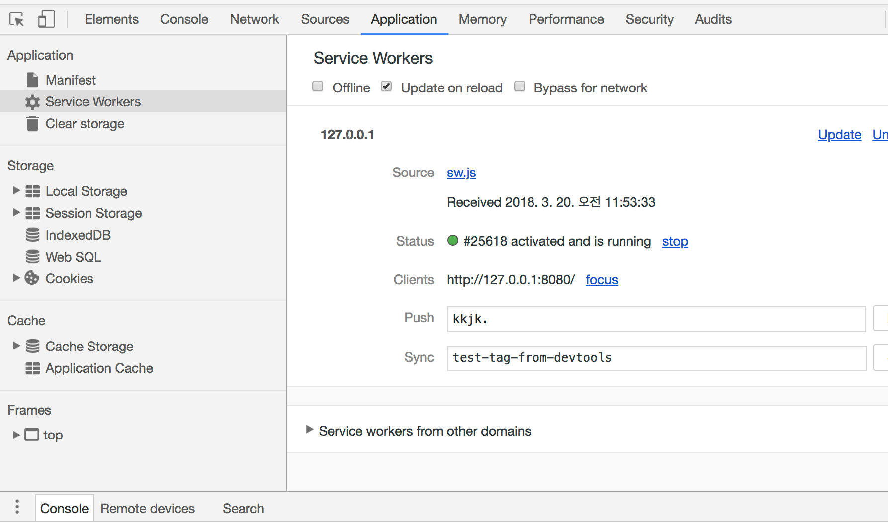
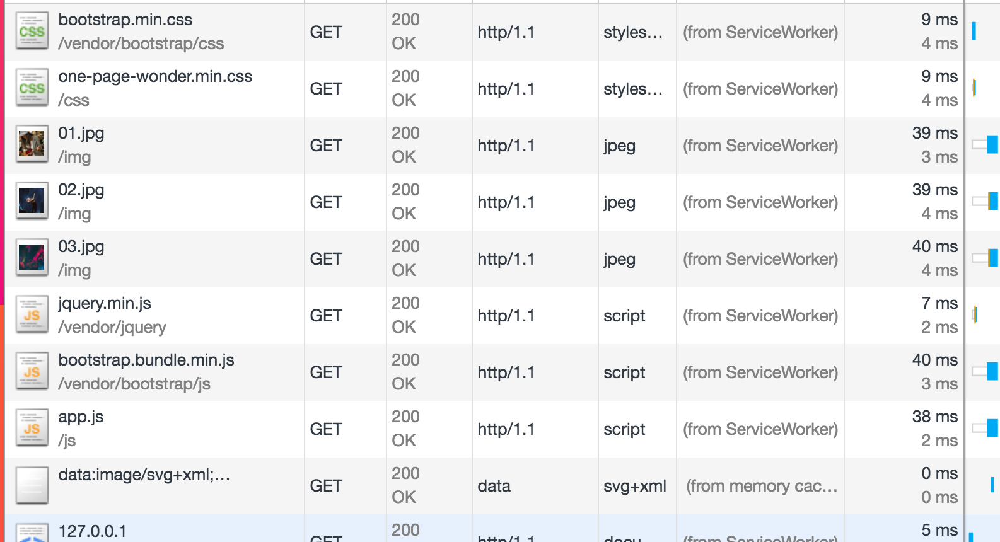

### 1. node 환경 

nodejs 설치!


### 2. base html download

```shell
git clone https://github.com/nigayo/pwa_learning.git
```

step1 branch 가 받아집니다.


### npm install 

```shell
npm install
```


### 3. local server 설치 

```shell
> sudo npm install live-server -g
```


### 4. browser 에서 확인

```shell
> live-server
```

브라우저에서 페이지 확인  :  http://127.0.0.1:8080/ 


### 5. PWA 진단

download 

https://developers.google.com/web/tools/lighthouse/

Performance 38

PWA 36


### Cache strategy

 static file cache 부터일단 캐시하자.


### service worker javascript 생성

sw.js 파일을 하나 생성하고, service worker 에 필요한 모든 동작을 여기에 추가할 것이다.

캐시이름도 정하고, 캐시대상리스트를 작성한다.

**sw.js**

```javascript
//static file cache
var cacheName = 'mystatic-1';

var filesToCache = [
    '/',
    '/index.html',
    '/js/app.js',
    '/css/one-page-wonder.min.css',
    '/vendor/bootstrap/css/bootstrap.min.css',
    '/vendor/bootstrap/js/bootstrap.bundle.min.js',
    '/vendor/jquery/jquery.min.js',
    '/img/01.jpg',
    '/img/02.jpg',
    '/img/03.jpg'
];

```


###  javascript 파일을 service work에 등록!

app.js 를 새로 만들어서, SW기능을 탐지하고, 등록하는 코드를 추가한다.

SW 에는 scope 개념이 있는데, SW.JS파일이 위치한 곳을 기준으로 cache 대상이 결정된다. 그 상위 디렉토리는 캐시 대상이 아니다.

**app.js**

```javascript
if ('serviceWorker' in navigator) {
    navigator.serviceWorker
        .register('./sw.js')
        .then((reg) => {
            console.log('Service Worker Registered', reg)
        }).catch((err) => {
            console.log("Service Worker registration failed: ", err);
        })
}
```

 app.js를 다 추가했으면, index.html 에 app.js 추가.


## 잘 등록됐나? 크롬디버깅 - Application탭을 확인하자. 




### cache에 static 데이터추가.

SW가 잘 설치된 것이 확인되면, cache객체에 resources를 추가한다.

**sw.js**

```Javascript
self.addEventListener( 'install', (e) => {
    console.log('[ServieWorker] install');
    e.waitUntil(
        caches.open(cacheName).then((cache) => {
            console.log('[ServiceWorker] caching app shell');
            return cache.addAll(filesToCache);
        })
    )
})

```

[window.caches](https://developer.mozilla.org/ko/docs/Web/API/Cache/keys) 객체의 open 메서드를 통해서 cache 저장 준비.

cache 객체의 의  addAll 메서드를 통해서 캐시 리스트를 캐시에 추가.

waitUntil 메서드를 통해서 캐시처리는 하는동안 service worker동작을  유지.


### cache 되었는지 확인!

개발자도구 - Application - Cache - Cache storage 항목에 

캐시된 파일 리스트가 노출돼야 함.


### service-worker 의 lifecyle

 Activated 이후에 Fetch 이벤트 등으로 request를 사로잡을 수 있음.

(현재까지의 실습 단계는 install 단계이다.)


### activate 이벤트 리스너

cache 여러가지가 계속 쌓일 수 있다.  SW가 활성화 되는 시점에 이전캐시를 지우기 딱 좋다.

SW 에는 activate이벤트 있으며, 이때 이전 캐시정보를 삭제하고 새로운 것을 업데이트하는 과정을 하면 된다.

```javascript
self.addEventListener('activate', function(e) {
    console.log('[ServiceWorker] Activate');
    e.waitUntil(
      caches.keys().then(function(keyList) {
        console.log(keyList);
        //cache 리스트를 이렇게 계속 내가 컨트롤해줘야 한다.
        return Promise.all(keyList.map(function(key) {
          if (key !== cacheName) {
            console.log('[ServiceWorker] Removing old cache', key);
            return caches.delete(key);
          }
        }));
      })
    );
    return self.clients.claim();
});
```


### 서버로 재요청시 network 탭에서 확인.

아직, 캐시된 값이 반환되지는 않고 있음.  캐시를 쓸 수 없는 단계.


### 캐시전략 세우기

service-work도 등록하고, 캐시정보도 기억하게 했음. 

이제 **캐시된 데이터를 활용**할 단계!!

서버로 요청되는 request 정보 중, cache 대상인 것은, cache에서 응답(response)하는 게 어떨까? 


​                               <출처 : https://mdn.mozillademos.org/files/12634/sw-fetch.png>


**fetch???**  

 Service worker가 requst정보를 가로챌 수 있는 것일까? 

>  **WOW, Service worker 는 일종의 client side proxy 이다!!!**

###  

### Service Worker 의 Events

install , activate 이외에, Functional events 가 있음. 

fetch/sync/push 를 통해서 동작 감시를 할 수 있음.


​           			<출처 :https://mdn.mozillademos.org/files/12632/sw-events.png>


### 'fetch' 이벤트 리스너 등록

http request 발생시 fetch 이벤트 핸들러가 발생!

caches 요소에 

```javascript
//http 요청이 있을때마다 발생.
self.addEventListener('fetch', (e) => {
    console.log('[ServiceWorker] Fetch', e.request.url);
    //fetch 이벤트 핸들러에는 respondWith 메서드가 있음. 브라우저에게 response를 전달.
    e.respondWith(
        caches.match(e.request).then((response) => {
            //cache에서 HTTP Response객체를 반환.  
            return response || fetch(e.request);
        })
    )
});
```

proxy 역할 수행 이후에 respondWith메서드를 통해서 브라우저에 response객체를 전달해준다. 

만약 response객체가 undefined이라면(즉 일치하는 게 없다면, fetch 함수를 통해서 서버로 fetch 전송을 한다.


### SW가 캐시에서 response객체를 제대로 반환하고 있는가?

크롬 개발자도구 Network탭에서 그 결과를 확인하자. 

캐시결과는 서버로 요청하지 않고 'from ServiecWorker 라는 메시지만 보임" 즉 캐시에서 받은  response객체를 사용하고 있고,  서버로 별도 request를 통해 response를 얻는 과정 없음.




### (잠깐, service worker 파일 업데이트 ?)

캐시해야 할 대상이 변경된 것으로 간주하고, install 부터 다시 발생.

하지만,, skipWaiting! 크롬탭이 닫히기 전까지는  새로고침으로 새로운 service-worker가 설치되지 않고 대기된다.

skipWaiting 을 강제로 클릭하거나, 탭을 닫고 다시 접속해야 새로운 sw가 설치되기 시작.


이 과정이 귀찮다면, **Update on reload** 에 체크를 한다.


### offline 테스트 

대부분의 파일이 SW를 통해 cache에서의 데이터를 response받는다면,  offline 인 경우에도 화면이 노출돼야 한다.

개발자도구의 Application탭의 Service Workers 의 **offline**을 체크하고 화면 로딩!


자~알 보인다.(그래야 함)


### Ajax 요청을 통해 추가 데이터 가져오기.

동적으로 요청한 데이터를 어떻게 캐시할 수 있을까?  

먼저 새로운 Ajax요청을 하는 코드를 작성한다.


**index.html**

```html
<!-- footer 바로 위에 추가 -->
<div class="moreBtn" style="
    width: 100%;
    background: #2c799d;
    height: 50px;
    text-align: center;
    /* padding: 5%; */
    line-height: 50px;
    cursor: pointer;
    font-size: 1.3em;
    color: #fff;
">하나 더 가져오기</div>
```


이제 DOMContentLoaded이후에, button을 클릭하면 서버로 data를 요청(fetch API사용)하는 코드를 구현하자.

template literal을 사용해서 templating작업을 한다.


아래 코드를 이해하고 넘어가자!

**app.js 하단**

```javascript
function makeTemplate({title, imgUrl}) {
    const tpl = `
        <section>
            <div class="container">
                <div class="row align-items-center">
                <div class="col-lg-6 order-lg-2">
                    <div class="p-5">
                    
                    </div>
                </div>
                <div class="col-lg-6 order-lg-1">
                    <div class="p-5">
                    <h2 class="display-4">${title}</h2>
                    <p>Lorem ipsum dolor sit amet, consectetur adipisicing elit. Quod aliquid, mollitia odio 
                    veniam sit iste esse assumenda amet aperiam exercitationem </p>
                    </div>
                </div>
                </div>
            </div>
            </section>
    `;
    return tpl;
}

function getAdditionalData() {
    fetch("http://crong.codesquad.kr:8080/wonder/rocker").then((res) => {
        return res.json();
    }).then((data) => {
        const tplResult = makeTemplate({title:data.title, imgUrl: 'http://crong.codesquad.kr:8080/img/'+data.img})
        const lastSection = document.querySelector("body > section:last-of-type");
        lastSection.insertAdjacentHTML("afterend", tplResult);
        document.querySelector(".moreBtn").style.display = "none";
    });
}

document.addEventListener("DOMContentLoaded", (e) => {
    document.querySelector(".moreBtn").addEventListener("click", (e) => {
        const apiurl = "http://crong.codesquad.kr:8080/wonder/rocker";
        getAdditionalData(apiurl)
    });
})
```


### 새로운 데이터 추가 확인

구현한 코드가 잘 동작하는지 보기위해, **'하나더가져오기'**를 하면 추가데이터가 서버로부터 받아서 온다. 

Network 탭을 통해, **fetch** 요청을 통해서 데이터 요청이 가고 있음을 알 수 있음.


### dynamic data cache 

새로운 데이터 캐시를 저장할 공간을 마련.


**sw.js** 안에 두 군데 dataCacheName 추가.

```javascript
var cacheName = 'pwa-test-8';
var dataCacheName = 'pwa-data-1';  //여기를 추가

...

self.addEventListener('activate', function(e) {
    e.waitUntil(
      caches.keys().then(function(keyList) {
        return Promise.all(keyList.map(function(key) {
          if (key !== cacheName && key!== dataCacheName) {    //여기를 추가
            console.log('[ServiceWorker] Removing old cache', key);
            return caches.delete(key);
          }
        }));
      })
    );
    return self.clients.claim();
});

```


### dynamic data cache 전략

Ajax 요청데이터를 일단 캐시하자. 

일단 Ajax요청데이터는 서버에서 자주 변경되는 경우라고 가정해본다.

그렇다면, Ajax요청의 결과는 캐시된 것을 믿기보다, 서버에서 매번 요청받은 데이터를 사용하는 것이 좋다!

결국 Ajax 요청을 매번 해야 한다.

그럼에도, 요청을 받아오기 전까지 캐시된 결과를 빨리 렌더링해서 화면에 보여주면 어떨까? 


그럼, 

**Ajax요청시 캐시된 결과가 있다면 캐시를 쓰고,** 

**동시에 Ajax요청을 다시 보냄으로써 새로운 데이터를 가져와서 화면에 뿌리자.**

**<cache then network** 전략>


​                  <참고 : https://developers.google.com/web/fundamentals/instant-and-offline/offline-cookbook>


### dynamic data cache를 위한 data cache!

Ajax요청이 가는 url을 기준으로 탐지하자.

 **sw.js**

```javascript
self.addEventListener('fetch', (e) => {
	var dataUrl = 'http://crong.codesquad.kr:8080/wonder/';

	if(e.request.url.includes(dataUrl)) {
    //data cache 처리.
    //여기에 뭔가 추가해야 함.       
	} else {
    //기존 static file cache 로직.
    	e.respondWith(
        	caches.match(e.request).then((response) => {
            	//cache에서 HTTP Response객체를 반환.  
            	return response || fetch(e.request);
        	});
    	)
	}
});
```


cache 객체를 열어서 response객체를 복사해서 cache에 추가하자. 그리고 원래의 response 를 반환해서 브라우저에 전달한다.

**sw.js**

```javascript
    if(e.request.url.includes(dataUrl)) {
        //data cache 처리.
        e.respondWith(
            caches.open(dataCacheName).then((cache) => {
                //가로채서 대신 request보내기. fetch를 사용한다.
                return fetch(e.request).then((response) => {
                    //response객체는 한번만 사용되게 되어 있음으로, 여기서 복사복은 만들어서 저장한다.
                    cache.put(e.request.url, response.clone())
                    return response;
                })
            })
        )
    } else {
```


이후에, 브라우저를 열고 , 서버에 데이터 요청을 한 이후,  

Application 탭의 Cache Storage 부분을 확인해서, 실제 캐시가 잘 됐는지 확인하자.


###Ajax 요청시 cache를 사용.

현재는 cache에 Ajax 응답객체를 저장한 상태이다.

이제 Ajax요청을 보내기 전에, 먼저 캐시에서 데이터를 가져와서 화면에 결과를 표시한다(렌더링).

물론 그 사이에 Ajax요청도 또 보낸다. 

이 타이밍에 비동기 통신이 두 개가 이뤄진다. (서로 경쟁적으로 처리될 것이다.)

**app.js**

```javascript
function getAdditionalData(url) {
    //append from Cache
    if('caches' in window) {
        caches.match(url).then((response) => {
            if (response) {
                response.json().then((data) => {
                    const tplResult = makeTemplate({title:data.title, imgUrl: 'http://crong.codesquad.kr:8080/img/'+data.img})
                    const lastSection = document.querySelector("body > section:last-of-type");
                    lastSection.insertAdjacentHTML("afterend", tplResult);
                    document.querySelector(".moreBtn").style.display = "none";
                });
            }
        })
    }
    
    fetch(url).then((res) => {
        return res.json();
    }).then((data) => {
```


### Ajax처리 좀 개선하기(cache then network 전략 구현)

cache에서 데이터를 먼저 가져와서 화면에 추가했다. 동시에 Ajax처리의 응답이 도착했을 것이다.


아래 Ajax 로 가져온 데이터를 화면에 다시 업데이트 하는 코드는 좀 변경됐다. 

이미 캐시로부터 렌더링이 된 상태임으로, 추가렌더링이 필요한지 적절하게 판단해야 한다. 예를들어  업데이트 할 내용이 이미 화면에 추가된 것과 동일하면 DOM업데이트 불필요할 것이다. 

아래는 이런 상세한 처리 없이 무조건 image와 title을 업데이트 하는 코드이다.

**app.js**

```javascript

function getAdditionalData(url) {

    //append from Cache
    if('caches' in window) {
        caches.match(url).then((response) => {
            if (response) {
                response.json().then((data) => {
                    console.log("Cache Updated");
                    const tplResult = makeTemplate({title:data.title, imgUrl: 'http://crong.codesquad.kr:8080/img/'+data.img})
                    const lastSection = document.querySelector("body > section:last-of-type");
                    lastSection.insertAdjacentHTML("afterend", tplResult);
                    document.querySelector(".moreBtn").style.display = "none";
                });
            }
        })
    }

    fetch(url).then((res) => {
        return res.json();
    }).then((data) => {
        if(data) {
            console.log("Ajax Updated");
            const lastSection = document.querySelector("body > section:last-of-type");
            const img = lastSection.querySelector("img");
            const title = lastSection.querySelector("h2");
            img.src = 'http://crong.codesquad.kr:8080/img/' + data.img;
            title.textContent = data.title;
        }
    });
}

```


### cache then network 결과 확인.

cache 결과가 화면에 잘 나타나는지 확인하자.

console 탭에 'Cache Updated' 이후에 Ajax Updated가 나타났다면, 제대로 두 번 렌더링이 된 것이다.


왜 그런지 설명해보기!


### offline 으로 테스트 해보기.

Ajax 데이터도 잘 나오는가? 

image 가 나오지 않는 이유는 무엇일까? 


우리가 놓친 URL Pattern ->.  http://crong.codesquad.kr:8080/img

fetch 이벤트에서 이 URL을 찾아서, 처리해줘야 한다.

cache에 있다면 response한다. 그렇지 않다면, 서버로 fetch보내고,  response객체를 복사해서 cache에 저장한다.

```javascript
 if(e.request.url.includes(dataUrl)) {
        e.respondWith(
            caches.open(dataCacheName).then((cache) => {
                //가로채서 대신 request보내기. fetch를 사용한다.
                return fetch(e.request).then((response) => {
                    //response객체는 한번만 사용되게 되어 있음으로, 여기서 복사복은 만들어서 저장한다.
                    cache.put(e.request.url, response.clone())
                    return response;
                })
            })
        )
    //image 처리 분기문을 추가했음.
    } else if(e.request.url.includes('http://crong.codesquad.kr:8080/img')){
        e.respondWith(
            caches.open(dataCacheName).then((cache) => {
                return cache.match(e.request).then((response) => {
                  return response || fetch(e.request).then((response) => {
                    cache.put(e.request, response.clone());
                    return response;
                  });
                });
            })
        )
    } else {
        .....
```


### Lighthouse 점수 

Performance 38 -> **100**

PWA 36 -> **64**

Best practices 88 -> **88**


###  중간 정리

지금까지의 과정을 Flow를 정리해보자. 

제대로, 예상대로 동작하는지 확인.

**그림 그리고 리뷰하기!**


## # 전략!

#### cache falling back to the network

- 아주 일반적이다. ( response || fetch(event.request))

- 자주 변경되지 않는 경우에 필요.

  ​

#### Network falling back to the cache

- network에 방어적인 해결책(오프라인).

- timeline등 자주 변경되는 경우에 필요.

- fetch(e.request).catch(() => caches.match(e.request))

  ​

#### Cache then network (cache-network race)

-  API 요청이 필요한 경우, 대체로 가장 좋은 전략.

####Generic fallback 

- Cache -> fetch(e.request) ->(catch) caches.match('offline.html');

